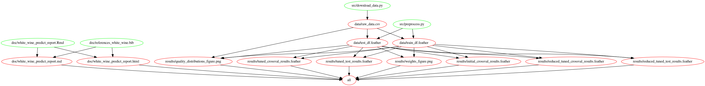

# Predicting white wine quality

  - author: DSCI 522 group 27

This is a group project for DSCI 522 in the MDS program at UBC.

## About

In this project we tested multiple machine learning models including dummy regressor, ridge and random forest regressor in order to assess how effectively each was able to build a regression model for predicting the quality scores of white wine based on the results physicochemical tests performed on each beverage. We carried out cross-validation on these three models and found that a random forest regressor achieved the best performance based on the metric of r2 scoring. We further refined the random forest regressor model through random search hyperparameter optimization and observed an r2 test score of 0.495 with a negative mean absolute error of -0.441 (note that we have imbalanced data, complicating this scoring process). We attempted to drop features with low target weights, however, this resulted in a model that performed worse on our data. Moreover, given the observed r2 scores, a random forest regressor may not be an appropriate model to use here. Ways that our model could be further improved would be to investigate the use of other complex models to improve our test scores, scoring on different metrics to guide our model selection and hyperparameter tuning, further hyperparameter tuning with our current model, or the use of more effective feature selection methods. Additionally, we could also experiment with changing the prediction task from a regression problem to a classification problem in order to potentially better match our dataset.

The dataset that was used for this project is of physicochemical features of wines with the corresponding wine quality ratings, this data set was created by Dr. P. Cortez, Dr. A. Cerdeira, Dr. F. Almeida, Dr. T. Matos and Dr. J. Reis. It was sourced from the UCI Machine Learning Repository (Cortez et al., 2009), and you can find it [here](https://archive.ics.uci.edu/ml/datasets/wine+quality). This dataset has two primary groups: white wine data and red wine data. We have chosen to analyse the white wine data since this data has many more observations than the red wine data observations. Note that the quality scores in this wine dataset are based on sensory data and are scored subjectively by reviewers.

## Report

The final report can be found [here](https://htmlpreview.github.io/?https://github.com/UBC-MDS/DSCI_522_group27/blob/main/doc/white_wine_predict_report.html)

## Usage

#### 1\. Using Docker

*note - the instructions in this section also depends on running this in
a unix shell (e.g., terminal or Git Bash)*

To replicate the analysis, install
[Docker](https://www.docker.com/get-started). Then clone this GitHub
repository and run the following command at the command line/terminal
from the root directory of this project:

    sudo docker run --rm -v "$(pwd):/project" -it tingyuzhang00/dsci_522_group27 make all

To reset the repo to a clean state, with no intermediate or results
files, run the following command at the command line/terminal from the
root directory of this project:

    sudo docker run --rm -v "$(pwd):/project" -it tingyuzhang00/dsci_522_group27 make clean

#### 2\. Without using Docker

To replicate the analysis, clone this GitHub repository, install the [dependencies](#dependencies) listed below, and run the following commands from the main directory of the project:
```
make all
```
To reset the repo to a clean state, with no intermediate or results files, run the following command at the command line/terminal from the root directory of this project:
```
make clean
```
## Dependencies

  - Python >=3.7 and Python packages:
      - docopt==0.6.2
      - pandas==1.1.4
      - pandas-profiling==2.9.0
      - matplotlib==3.3.3
      - altair==4.1.0
      - numpy==1.19.4
      - scikit-learn==0.23.2
      - altair_saver==0.5.0
      - pyarrow==2.0.0
      
  - R version >=3.6 and R packages:
      - rmarkdown==2.5
      - knitr==1.30
      - feather==0.3.5
      - arrow==2.0.0
      
  - GNU make 4.2.1
  
  - Vega-Lite and Canvas
      - these must be installed into base environment using command `npm install -g vega vega-lite vega-cli canvas`

## Dependency diagram

  

# License 
The materials on predicting white wine quality are licensed under the MIT License 
(Copyright (c) 2020 Master of Data Science at the University of British Columbia)

# References

P. Cortez, A. Cerdeira, F. Almeida, T. Matos and J. Reis.
Modeling wine preferences by data mining from physicochemical properties. In Decision Support Systems, Elsevier, 47(4):547-553, 2009.
