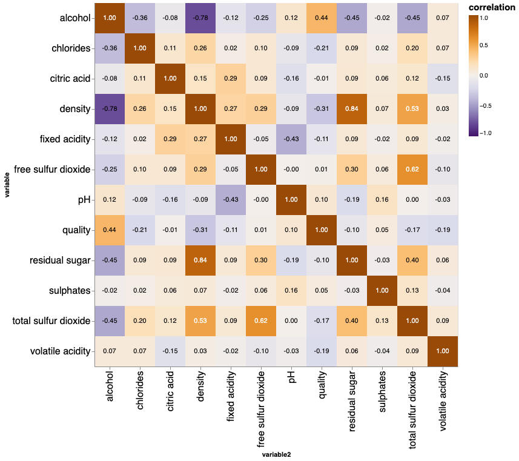
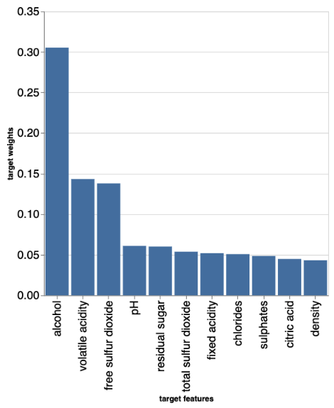

```{r setup, include=FALSE}
knitr::opts_chunk$set(echo = TRUE)
```

# **Summary**

Here we tried different models such as dummy regressor, ridge and random forest regressor to predict the white wine quality. When we carried out the cross-validation for these three models, we chose random forest regressor as our best performance model by comparing different metrics. We tried hyperparameter optimization with random forest regressor to get the final test score around 0.4311, which seems to be not reasonable here (Note that we have imbalanced data). Therefore, random forest regressor may not be an appropriate model to use here. However, we can find other models to improve our test scores, or we can carry out a different metric or tune other hyperparameters to get a better result. Moreover, we can also change the prediction task from a regression problem to a classification problem in order to find a better prection.

# **Introduction**

The wine market occupies a significant position among consumers. For manufacturers, the quality of alcohol significantly affects the sales of alcoholic beverages, but the taster is not necessarily the only standard for judging the quality of alcoholic beverages. We can establish a model to estimate the quality of alcoholic drinks through chemical substances. However, this may require a lot of professional knowledge. We found a good article which was written by Dr. P. Cortez, Dr. A. Cerdeira, Dr. F. Almeida, Dr. T. Matos and Dr. J. Reis, and they used a data mining approach to get promising results comparing neural network methods [@CORTEZ2009547].

Here we want to try different regression models to predict the wine quality based on the physicochemical test features. Answering this question is crucial since we want to support the wine tasting evaluations of oenologists and contribute to wine production [@CORTEZ2009547].

# **Methods**

## **Data**

The dataset that we used came from the University of California Irvine (UCI) machine learning repository and was collected by Paulo Cortez, University of Minho, Guimarães, Portugal and A. Cerdeira, F. Almeida, T. Matos with help from J. Reis, Viticulture Commission of the Vinho Verde Region(CVRVV), Porto, Portugal in 2009. The dataset contains the results of various physiochemical tests on white "Vinho Verde" wine samples from Northern Portugal and can be found [here](https://archive.ics.uci.edu/ml/datasets/wine+quality) specifically with the [white wine dataset](%5Bhttps://archive.ics.uci.edu/ml/machine-learning-databases/wine-quality/winequality-white.csv). No additional features or specific branding of each wine is available in the dataset for privacy purposes. Each row in the dataset represents a single wine which was tested and scored based on sensory data.

## **Analysis**

A classification model was built with [@Python] scripts using the [@scikit-learn] `RandomForestRegressor` algorithm was and allowed us to predict a sensory score based on the physiochemical testing information recorded for each wine. Because of the privacy constraints of the data our dataset is somewhat limited since useful potentially factors that might influence the scoring such as grape types, brand names, or price are not available to us. Assumptions we made regarding this dataset are that the quality scores came from the opinions of wine critics and that testing for all wines was consistent. The model was fit using all??? of the variables from the dataset. Hyperparameters `n_estimators` and `max_depth` were optimized via random search while all other hyperparameters used the default sklearn `RandomForestRegressor` values. The data was processed using the [@reback2020pandas] package. This document was compiled using an [@R] document file with scripts run using the [@docopt] package.

# **Results & Discussion**

To determine how useful strong of an influence each feature has on the quality score we created a correlation plot using the altair package which shows how each of the different features is correlated with each other. This chart showed us that different features had varying degrees of influence on the quality score, with increased alcohol content and decreased density most heavily influencing the quality score. 

```{r fig_1, echo=FALSE, fig.cap="Figure 1. Correlation plot of the correlation between features in the white wine dataset.", out.width = '60%'}

# [picture of our correlation plot]
```

We found that a random forest classifier and, after performing random search hyperparameter optimization, that hyperparameters `n_estimators` and `max_depth` set to values of 300 and 10 respectively produced the best model for our dataset. This resulted in use producing a model with a training score of 0.726 and a testing score of 0.431. We then examined the weight of the features present in this model were able to chart the effect that each feature had on the model. Alcohol was found to be the feature most highly associated with higher quality scores.

```{r fig_2, echo=FALSE, fig.cap="Figure 2. Bar chart showing the target weights of different features of our RandomForestRegressor model.", out.width = '60%'}

```

# Limitations & Future

Some potential limitations of our model thus far are that we have only tested a handful of different regression methods and only performed light hyperparameter optimization thus far. There likely exists combinations which will lead to better scoring in our model. If provided with more time we would be able to improve our analysis by looking for these potentially better model/hyperparameter combinations. Another way to improve our model would be to implement a form of feature selection given that we are still including all features and that many of them seem to have little influence on the scoring of our model.

# References

| P. Cortez, A. Cerdeira, F. Almeida, T. Matos and J. Reis.
|       Modeling wine preferences by data mining from physicochemical properties. In Decision Support Systems, Elsevier, 47(4):547-553, 2009.
| 
| 
