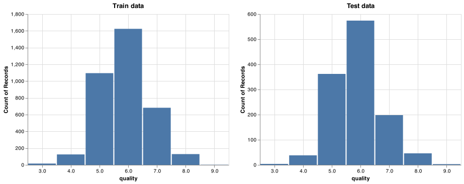
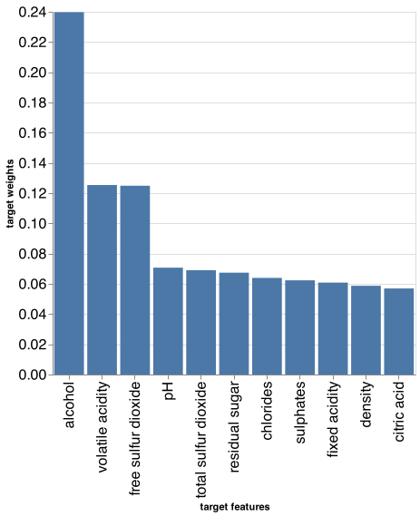

Predicting quality of white wine from various characteristics
================
DSCI 522 group 27

# **Summary**

In this project we tested multiple machine learning models including
dummy regressor, ridge and random forest regressor in order to assess
how effectively each was able to build a regression model for predicting
the quality scores of white wine based on the results physicochemical
tests performed on each beverage. We carried out cross-validation on
these three models and found that a random forest regressor achieved the
best performance based on the metric of r2 scoring. We further refined
the random forest regressor model through random search hyperparameter
optimization and observed an r2 test score of 0.492 with a negative mean
absolute error of -0.443 (note that we have imbalanced data,
complicating this scoring process). We attempted to drop features with
low target weights, however, this resulted in a model that performed
worse on our data. Moreover, given the observed r2 scores, a random
forest regressor may not be an appropriate model to use here. Ways that
our model could be further improved would be to investigate the use of
other complex models to improve our test scores, scoring on different
metrics to guide our model selection and hyperparameter tuning, further
hyperparameter tuning with our current model, or the use of more
effective feature selection methods. Additionally, we could also
experiment with changing the prediction task from a regression problem
to a classification problem in order to potentially better match our
dataset.

# **Introduction**

The wine market is a multi-billion dollar industry with various
consumers worldwide. For some manufacturers, the quality of their wine
can significantly affect the sales of their product, with the personal
tastes of judges typically representing a standard of quality for the
given beverage. In order to challenge this, we can establish a model
tuned through machine learning to estimate the quality of alcoholic
drinks based on specific chemical properties of each beverage. However,
this task will likely require a lot of insider knowledge. We found a
paper by Dr. P. Cortez, Dr. A. Cerdeira, Dr. F. Almeida, Dr. T. Matos
and Dr. J. Reis, where they were able to demonstrate the results of a
data mining approach which demonstrated promising results compared to
alternative neural network methods (Cortez et al. 2009).

Here we want to try different regression models to predict the wine
quality based on the results of various physicochemical tests performed
on each individual product. The results of this experiment could be used
in support of the wine tasting evaluations of oenologists and contribute
to improved wine production quality (Cortez et al. 2009).

# **Methods**

## **Data**

The dataset used in this project was retrieved from the University of
California Irvine (UCI) machine learning repository and was collected by
Paulo Cortez, University of Minho, Guimarães, Portugal and A. Cerdeira,
F. Almeida, T. Matos with help from J. Reis, Viticulture Commission of
the Vinho Verde Region(CVRVV), Porto, Portugal in 2009. This dataset
contains the results of various physiochemical test (including scoring
for properties such as alcohol content, pH, and residual sugar) which
were preformed on white “Vinho Verde” wine samples from Northern
Portugal. The data can be found
[here](https://archive.ics.uci.edu/ml/datasets/wine+quality), with the
[white wine
dataset](%5Bhttps://archive.ics.uci.edu/ml/machine-learning-databases/wine-quality/winequality-white.csv)
being the specific document used in our analysis. No additional features
or specific branding of each wine is available in the dataset for
privacy purposes. Each row in the dataset represents a single wine which
was tested and scored based on human sensory data.

## **Analysis**

A regression model was built with python scripts using the sk-learn
`RandomForestRegressor` algorithm and allowed us to predict a sensory
score based on the physiochemical testing information recorded for each
wine(Van Rossum and Drake 2009), (Pedregosa et al. 2011). Due to privacy
constraints the dataset is somewhat limited in scope. This means that
factors that could potentially influence the scoring of each wine such
as grape types, brand names, and price have been omitted. Assumptions
made regarding this dataset are that the quality scores came from the
opinions of wine critics and that testing for all wines was consistent.
It is unclear what information the wine critics had access to when
assessing each wine (i.e. if scoring was done with a blind taste test or
if the judges were aware of factors such as the price of each wine). All
models built in our analysis were fit using all of the variables from
the dataset. Hyperparameters `n_estimators` and `max_depth` were
optimized via random search while all other hyperparameters used the
default sklearn `RandomForestRegressor` values. The data was processed
using the pandas package and EDA was performed using the
pandas-profiling package (team 2020) (Brugman 2019). This document was
compiled using an R document file with scripts run using the docopt
package (R Core Team 2019), (de Jonge 2020). Tables were stored using
feather files (with dependency on arrow) and displayed using knitr’s
kable function (Wickham 2019), (François et al. 2020), (Xie 2020). This
document was compiled using rmarkdown (Allaire et al. 2020).

# **Results & Discussion**

After splitting our dataset into a training set and a validation set we
plotted the distribution of the quality scores for each wine (Figure 1).
Despite the quality scoring being performed a scale from 1-10 only
values in the range of 3-9 were observed. It can be seen that our data
is significantly imbalanced, with 6 being the most common score observed
across all testing while scores such as 3 and 9 were rarely seen.

Figure 1. Quality distribution of wines in the training and test
datasets.

In order to determine which model works best with our data we decided to
test both the `RidgeCV` and `RandomForestRegressor` to compare them
against the dummy regressor model. Scoring was done with r2 scores due
to an imbalance in our data. The cross-validation performed with 3-fold
validation in order to maintain an efficient analysis speed. We present
the cross-validation values of this testing in Table 1.

| index                             | dummyregressor |      ridge | randomforest |
|:----------------------------------|---------------:|-----------:|-------------:|
| fit\_time                         |      0.0009468 |  0.0029685 |    1.1786951 |
| score\_time                       |      0.0007962 |  0.0023263 |    0.0178180 |
| test\_neg\_mean\_squared\_error   |     -0.7899251 | -0.5794524 |   -0.3924718 |
| train\_neg\_mean\_squared\_error  |     -0.7896847 | -0.5687437 |   -0.0553803 |
| test\_neg\_mean\_absolute\_error  |     -0.6766545 | -0.5909963 |   -0.4585544 |
| train\_neg\_mean\_absolute\_error |     -0.6765906 | -0.5871736 |   -0.1705949 |
| test\_r2                          |     -0.0007601 |  0.2655188 |    0.5029517 |
| train\_r2                         |      0.0000000 |  0.2797630 |    0.9298684 |

Table 1. Table of cross-validation results for each tested model

We found that random forest classifier worked best with our dataset and
decided to perform random search hyperparameter optimization (with 28
iterations) to tune the hyperparameters `n_estimators` and `max_depth`,
for which we obtained the best values of 2000 and 30, respectively.
Running `RandomForestRegressor` with these hyperparameters resulted in a
training r2 score of 0.931 and a validation r2 score of 0.504 (Table 2).

| index                             | Tuned Model |
|:----------------------------------|------------:|
| fit\_time                         |  23.3283576 |
| score\_time                       |   0.2973887 |
| test\_neg\_mean\_squared\_error   |  -0.3898822 |
| train\_neg\_mean\_squared\_error  |  -0.0532080 |
| test\_neg\_mean\_absolute\_error  |  -0.4555802 |
| train\_neg\_mean\_absolute\_error |  -0.1683919 |
| test\_r2                          |   0.5061903 |
| train\_r2                         |   0.9326150 |

Table 2. Cross-validation training results of the tuned random forest
model

Running our hyperparameter tuned `RandomForestClassifier` model on our
test data resulted in an r2 test score of 0.492 and a negative mean
absolute error of -0.444 (Table 3). These results are comparable to
those that we observed in our validation scoring, which produced similar
values (with r2 scoring differing by only about 0.01).

| index                      | Test Results |
|:---------------------------|-------------:|
| neg\_mean\_absolute\_error |   -0.4411732 |
| neg\_mean\_squared\_error  |   -0.3873119 |
| r2                         |    0.4954661 |

Table 3. Tuned RandomForestClassifier model test results.

We then examined the weight of the features present in our best scoring
`RandomForestClassifier` and charted the weight of each in the model
(Figure 2). Alcohol was found to be the feature most heavily associated
with higher wine quality scores with a target weight of 0.24. Other
features such as density, citric acid, and sulphates appear to have
limited influence on our model.

Figure 2. Bar chart showing the target weights of different features of
our RandomForestRegressor model.

In an attempt to further improve the scoring of our model we decided to
drop all features with a target weight lower than 0.10, meaning we
decided to run a model that predicted quality scores based on the
features alcohol, free sulfur dioxide, and volatile acidity. Thus we ran
the model again with only these features and observed an improved
training r2 score of 0.713 but a decreased validation r2 score of 0.377
(Table 4). This marks a decrease in both training and validation scores
compared to our version of the model which did not have these features
removed.

| index                             | Tuned Model (Reduced Features) |
|:----------------------------------|-------------------------------:|
| fit\_time                         |                      5.3600808 |
| score\_time                       |                      0.2196057 |
| test\_neg\_mean\_squared\_error   |                     -0.4881840 |
| train\_neg\_mean\_squared\_error  |                     -0.1410332 |
| test\_neg\_mean\_absolute\_error  |                     -0.5211449 |
| train\_neg\_mean\_absolute\_error |                     -0.2805931 |
| test\_r2                          |                      0.3813291 |
| train\_r2                         |                      0.8213872 |

Table 4. Tuned (+ reduced features) RandomForestClassifier
Cross-validation training results.

In order to best understand how this reduced model compares to our
original model we decided to run the reduced feature model on the test
set which returned an r2 score of 0.354 and a negative mean absolute
error of -0.528 (Table 5). This is a significant decrease compared to
the score of the model from before we removed the features (0.492)
marking the removal of all feature except alcohol, free sulfur dioxide,
and volatile acidity a poor decision for the scoring quality of our
model. This also means that the best model we have built for this data
is the one that is represented in table 2 and table 3, and that they
represent the highest scoring model we have produced for our dataset.

| index                      | Test Results |
|:---------------------------|-------------:|
| neg\_mean\_absolute\_error |   -0.5158896 |
| neg\_mean\_squared\_error  |   -0.4967308 |
| r2                         |    0.3529310 |

Table 5. Tuned (+ reduced features) RandomForestClassifier model test
results.

# Limitations & Future

Some potential limitations of our model are that we have only tested a
handful of different regression methods and only have performed light
hyperparameter optimization via a random search. There likely exists
combinations of models and hyperparameters (perhaps determined through a
grid search, though this would increase the runtime of our model
significantly) which would lead to better scoring in our model. For
example, using support vector machine (SVM) methods might be a more
effective way to predict wine scores as they were specifically mentioned
by Cortez et al. in their paper analyzing the dataset (Cortez et al.
2009). Another way to improve our model would be to implement a form of
feature selection (such as RFECV) given that we our current method
involves us manually selecting our features based on their target
weights and currently results in a worse model.

Another avenue of improvement for our model would be to work with a
larger dataset (i.e. with wine/judges from around the world) or with a
greater number of features we might expect to be tied to wine quality
(type of grape used in the wine, price, etc.) since the one we are
currently working with omits some information for the sake of privacy
protection.

Additionally, since our current model handles the prediction task as a
regression problem we may find it useful to experiment with treating it
as a classification problem instead. This is because wine scoring is
only done with whole numbers on a scale from 1 to 10, with values in the
range of 3 to 9 being the only scores used in our dataset.

# References

Allaire, JJ, Yihui Xie, Jonathan McPherson, Javier Luraschi, Kevin
Ushey, Aron Atkins, Hadley Wickham, Joe Cheng, Winston Chang, and
Richard Iannone. 2020. *Rmarkdown: Dynamic Documents for R*.
<https://github.com/rstudio/rmarkdown>.

Brugman, Simon. 2019. “pandas-profiling: Exploratory Data Analysis for
Python.” <https://github.com/pandas-profiling/pandas-profiling>.

Cortez, Paulo, Antonio Cerdeira, Fernando Almeida, Telmo Matos, and Jose
Reis. 2009. “Modeling Wine Preferences by Data Mining from
Physicochemical Properties.” *Decision Support Systems* 47 (4): 547–53.
<https://doi.org/https://doi.org/10.1016/j.dss.2009.05.016>.

de Jonge, Edwin. 2020. *Docopt: Command-Line Interface Specification
Language*. <https://CRAN.R-project.org/package=docopt>.

François, Romain, Jeroen Ooms, Neal Richardson, and Apache Arrow. 2020.
*Arrow: Integration to ’Apache’ ’Arrow’*.
<https://CRAN.R-project.org/package=arrow>.

Pedregosa, F., G. Varoquaux, A. Gramfort, V. Michel, B. Thirion, O.
Grisel, M. Blondel, et al. 2011. “Scikit-Learn: Machine Learning in
Python.” *Journal of Machine Learning Research* 12: 2825–30.

R Core Team. 2019. *R: A Language and Environment for Statistical
Computing*. Vienna, Austria: R Foundation for Statistical Computing.
<https://www.R-project.org/>.

team, The pandas development. 2020. *Pandas-Dev/Pandas: Pandas* (version
latest). Zenodo. <https://doi.org/10.5281/zenodo.3509134>.

Van Rossum, Guido, and Fred L. Drake. 2009. *Python 3 Reference Manual*.
Scotts Valley, CA: CreateSpace.

Wickham, Hadley. 2019. *Feather: R Bindings to the Feather ’Api’*.
<https://CRAN.R-project.org/package=feather>.

Xie, Yihui. 2020. *Knitr: A General-Purpose Package for Dynamic Report
Generation in R*. <https://yihui.org/knitr/>.

