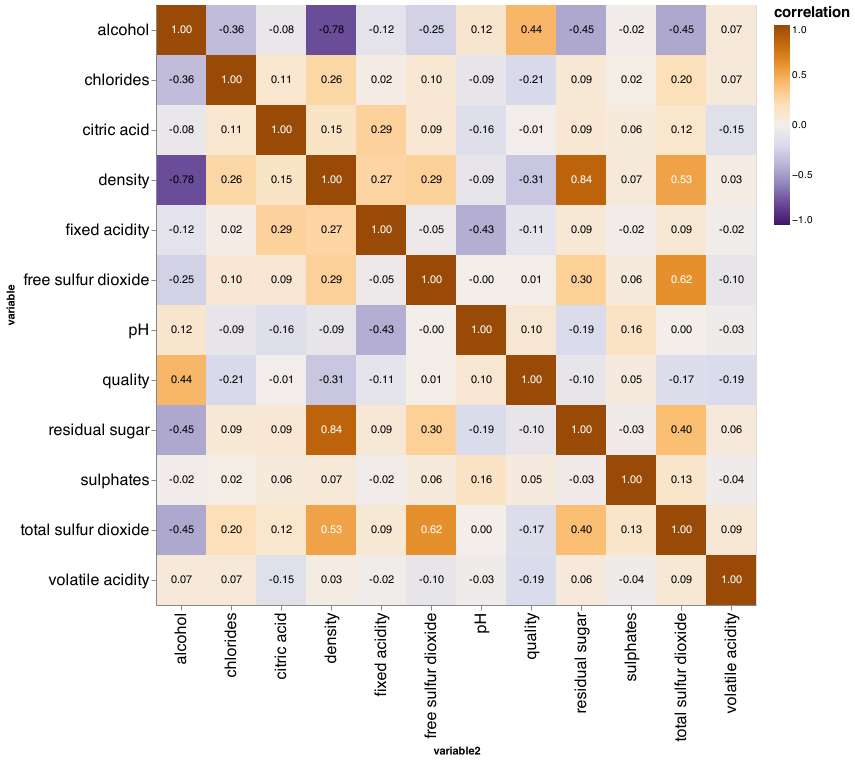

Predicting quality of white wine from various characteristics
================
DSCI 522 group 27

# **Summary**

Here we tried different models such as dummy regressor, ridge and random
forest regressor to predict the white wine quality. When we carried out
the cross-validation for these three models, we chose random forest
regressor as our best performance model by comparing different metrics.
We tried hyperparameter optimization with random forest regressor to get
the r2 score of 0.492 as our final test score with a negative mean
absolute error of -0.443, which seems to be not reasonable here (Note
that we have imbalanced data). Therefore, random forest regressor may
not be an appropriate model to use here. However, we can find other
complex models to improve our test scores, or we can carry out a
different metric or tune other hyperparameters to get a better result.
Moreover, we can also change the prediction task from a regression
problem to a classification problem in order to find a better
prediction.

# **Introduction**

The wine market occupies a significant position among consumers. For
manufacturers, the quality of alcohol significantly affects the sales of
alcoholic beverages, but the taster is not necessarily the only standard
for judging the quality of alcoholic beverages. We can establish a model
to estimate the quality of alcoholic drinks through chemical substances.
However, this may require a lot of professional knowledge. We found a
good article which was written by Dr. P. Cortez, Dr. A. Cerdeira, Dr. F.
Almeida, Dr. T. Matos and Dr. J. Reis, and they used a data mining
approach to get promising results comparing neural network methods
(Cortez et al. 2009).

Here we want to try different regression models to predict the wine
quality based on the physicochemical test features. Answering this
question is crucial since we want to support the wine tasting
evaluations of oenologists and contribute to wine production (Cortez et
al. 2009).

# **Methods**

## **Data**

The dataset that we used came from the University of California Irvine
(UCI) machine learning repository and was collected by Paulo Cortez,
University of Minho, Guimarães, Portugal and A. Cerdeira, F. Almeida, T.
Matos with help from J. Reis, Viticulture Commission of the Vinho Verde
Region(CVRVV), Porto, Portugal in 2009. The dataset contains the results
of various physiochemical tests on white “Vinho Verde” wine samples from
Northern Portugal and can be found
[here](https://archive.ics.uci.edu/ml/datasets/wine+quality)
specifically with the [white wine
dataset](%5Bhttps://archive.ics.uci.edu/ml/machine-learning-databases/wine-quality/winequality-white.csv).
No additional features or specific branding of each wine is available in
the dataset for privacy purposes. Each row in the dataset represents a
single wine which was tested and scored based on sensory data.

## **Analysis**

A classification model was built with python scripts using the sk-learn
`RandomForestRegressor` algorithm and allowed us to predict a sensory
score based on the physiochemical testing information recorded for each
wine(Van Rossum and Drake 2009), (Pedregosa et al. 2011). Because of the
privacy constraints of the data our dataset is somewhat limited since
useful potentially factors that might influence the scoring such as
grape types, brand names, or price are not available to us. Assumptions
we made regarding this dataset are that the quality scores came from the
opinions of wine critics and that testing for all wines was consistent.
The model was fit using all of the variables from the dataset.
Hyperparameters `n_estimators` and `max_depth` were optimized via random
search while all other hyperparameters used the default sklearn
`RandomForestRegressor` values. The data was processed using the pandas
package and EDA was performed using the pandas-profiling package (team
2020) (Brugman 2019). This document was compiled using an R document
file with scripts run using the docopt package (R Core Team 2019), (de
Jonge 2020). Tables were stored using feather files (with dependency on
arrow) and displayed using knitr’s kable function (Wickham 2019),
(François et al. 2020), (Xie 2020). This document was compiled using
rmarkdown (Allaire et al. 2020).

# **Results & Discussion**

After splitting our dataset into a training set and a test set we
plotted the distribution of the quality scores for each wine (Figure 1).
Despite the quality scoring being performed a scale from 1-10 only
values in the range of 3-9 were observed. 6 was the most common score
observed across all testing.

Figure 1. Quality distribution of wines in the training and test
datasets.

To determine how useful strong of an influence each feature has on the
quality score we created a correlation plot using the altair package
(built off of Vega-Lite) which shows how each of the different features
is correlated with each other (Figure 2) (VanderPlas et al. 2018),
(Satyanarayan et al. 2017). This chart showed us that different features
had varying degrees of influence on the quality score, with increased
alcohol content and decreased density most heavily influencing the
quality score.

Figure 2. Correlation plot of the correlation between features in the
white wine dataset.

In order to determine which model works best with our data we decided to
test both the `RidgeCV()` and `RandomForest()` to compare them against
the dummy regressor model. We present the cross-validation values of
this testing in Table 1. We found that random forest methods provided
the best test and training model scores and decided to proceed with
those.

| index                             | dummyregressor |      ridge | randomforest |
|:----------------------------------|---------------:|-----------:|-------------:|
| fit\_time                         |      0.0010484 |  0.0039698 |    2.2993660 |
| score\_time                       |      0.0008756 |  0.0031053 |    0.0345884 |
| test\_neg\_mean\_squared\_error   |     -0.7899251 | -0.5794524 |   -0.3924718 |
| train\_neg\_mean\_squared\_error  |     -0.7896847 | -0.5687437 |   -0.0553803 |
| test\_neg\_mean\_absolute\_error  |     -0.6766545 | -0.5909963 |   -0.4585544 |
| train\_neg\_mean\_absolute\_error |     -0.6765906 | -0.5871736 |   -0.1705949 |
| test\_r2                          |     -0.0007601 |  0.2655188 |    0.5029517 |
| train\_r2                         |      0.0000000 |  0.2797630 |    0.9298684 |

Table 1. Table of cross-validation results for each tested model

We found that a random forest classifier and, after performing random
search hyperparameter optimization, that hyperparameters `n_estimators`
and `max_depth` set to values of 300 and 10 respectively produced the
best model for our dataset. This resulted in us producing a model with a
training score of 0.929 and a testing score of 0.505 (Table 2).

| index                             | Tuned Model |
|:----------------------------------|------------:|
| fit\_time                         |  10.1597231 |
| score\_time                       |   0.1239612 |
| test\_neg\_mean\_squared\_error   |  -0.3905119 |
| train\_neg\_mean\_squared\_error  |  -0.0558802 |
| test\_neg\_mean\_absolute\_error  |  -0.4569208 |
| train\_neg\_mean\_absolute\_error |  -0.1736196 |
| test\_r2                          |   0.5053642 |
| train\_r2                         |   0.9292326 |

Table 2. Table of cross-validation results of the tuned model

We then examined the weight of the features present in our most
effective random forest model and charted the effect that each feature
had on the model (Figure 3). Alcohol was found to be the feature most
highly associated with higher quality scores. Other features such as
density, citric acid, and sulphates appear to have limited weight in our
model.

Figure 3. Bar chart showing the target weights of different features of
our RandomForestRegressor model.

After performing tuning on all of our hyperparamters we made another
`RandomForestClassifier` model using the optimized values. This resulted
in r2 score of 0.492 when run through our final test with a negative
mean absolute error of -0.443 (Table 3). These results are comparable to
what we observed in our testing score where we observed very similar
values.

| index                      | Test Results |
|:---------------------------|-------------:|
| neg\_mean\_absolute\_error |   -0.4434123 |
| neg\_mean\_squared\_error  |   -0.3896619 |
| r2                         |    0.4924049 |

Table 3. Tuned test results of RandomForestClassifier.

# Limitations & Future

Some potential limitations of our model thus far are that we have only
tested a handful of different regression methods and only have performed
light hyperparameter optimization. There likely exists combinations of
models and hyperparamters which will lead to better scoring in our
model. SVM might be an effective model to test for our problem as it was
specifically mentioned in the paper by Cortez et al. (Cortez et al.
2009). Another way to improve our model would be to implement a form of
feature selection (such as RFECV) given that we are still including all
features and that many of them seem to have little influence on the
scoring of our model. We could also potentially find a larger dataset
(i.e. with wine from around the world) or with more features since the
one we are currently working with has a limited number of features
(i.e. type of grape used in the wine) due for the sake of privacy
protection.

# References

Allaire, JJ, Yihui Xie, Jonathan McPherson, Javier Luraschi, Kevin
Ushey, Aron Atkins, Hadley Wickham, Joe Cheng, Winston Chang, and
Richard Iannone. 2020. *Rmarkdown: Dynamic Documents for r*.
<https://github.com/rstudio/rmarkdown>.

Brugman, Simon. 2019. “pandas-profiling:
Exploratory Data Analysis for Python.”
<https://github.com/pandas-profiling/pandas-profiling>.

Cortez, Paulo, Antonio Cerdeira, Fernando Almeida, Telmo Matos, and Jose
Reis. 2009. “Modeling Wine Preferences by Data Mining from
Physicochemical Properties.” *Decision Support Systems* 47 (4): 547–53.
https://doi.org/<https://doi.org/10.1016/j.dss.2009.05.016>.

de Jonge, Edwin. 2020. *Docopt: Command-Line Interface Specification
Language*. <https://CRAN.R-project.org/package=docopt>.

François, Romain, Jeroen Ooms, Neal Richardson, and Apache Arrow. 2020.
*Arrow: Integration to ’Apache’ ’Arrow’*.
<https://CRAN.R-project.org/package=arrow>.

Pedregosa, F., G. Varoquaux, A. Gramfort, V. Michel, B. Thirion, O.
Grisel, M. Blondel, et al. 2011. “Scikit-Learn: Machine Learning in
Python.” *Journal of Machine Learning Research* 12: 2825–30.

R Core Team. 2019. *R: A Language and Environment for Statistical
Computing*. Vienna, Austria: R Foundation for Statistical Computing.
<https://www.R-project.org/>.

Satyanarayan, Arvind, Dominik Moritz, Kanit Wongsuphasawat, and Jeffrey
Heer. 2017. “Vega-Lite: A Grammar of Interactive Graphics.” *IEEE
Transactions on Visualization and Computer Graphics* 23 (1): 341–50.

team, The pandas development. 2020. *Pandas-Dev/Pandas: Pandas* (version
latest). Zenodo. <https://doi.org/10.5281/zenodo.3509134>.

Van Rossum, Guido, and Fred L. Drake. 2009. *Python 3 Reference Manual*.
Scotts Valley, CA: CreateSpace.

VanderPlas, Jacob, Brian Granger, Jeffrey Heer, Dominik Moritz, Kanit
Wongsuphasawat, Arvind Satyanarayan, Eitan Lees, Ilia Timofeev, Ben
Welsh, and Scott Sievert. 2018. “Altair: Interactive Statistical
Visualizations for Python.” *Journal of Open Source Software* 3 (32):
1057. <https://doi.org/10.21105/joss.01057>.

Wickham, Hadley. 2019. *Feather: R Bindings to the Feather ’API’*.
<https://CRAN.R-project.org/package=feather>.

Xie, Yihui. 2020. *Knitr: A General-Purpose Package for Dynamic Report
Generation in r*. <https://yihui.org/knitr/>.

